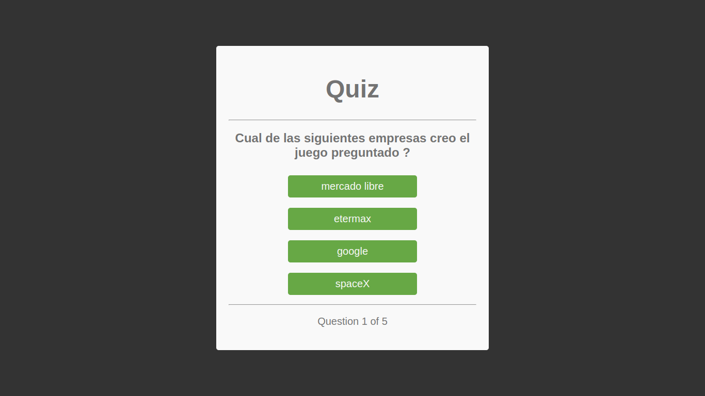

# Quiz - App - Javascript :memo:

App de pregutas creada utilizando el paradigma de programacion orientada a objetos en **Javascript** y estilos en **CSS** puro, la app accede a las preguntas, opciones y respuestas desde un archivo **Json** externo

